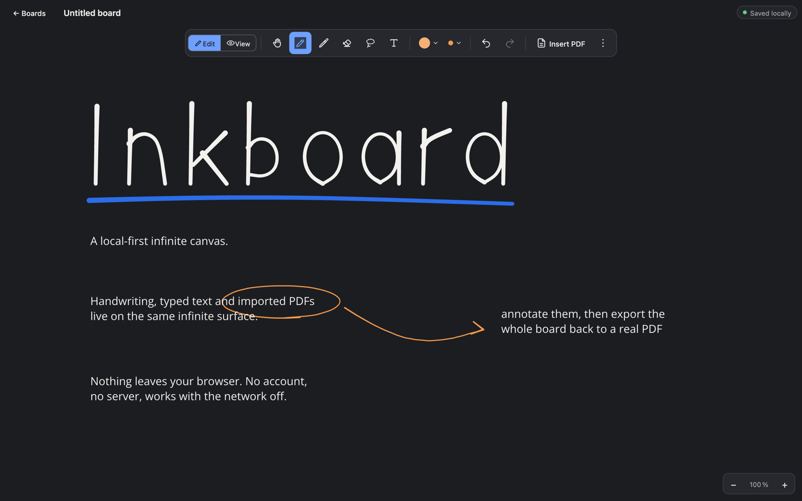
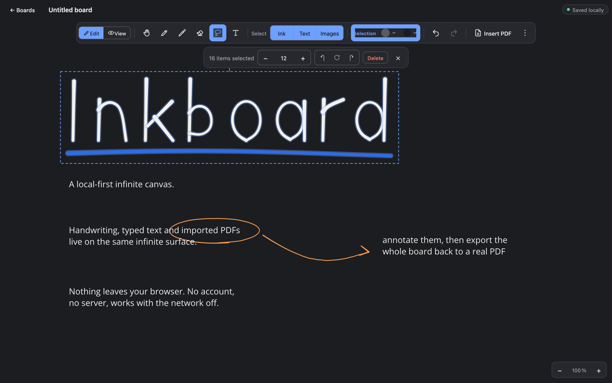
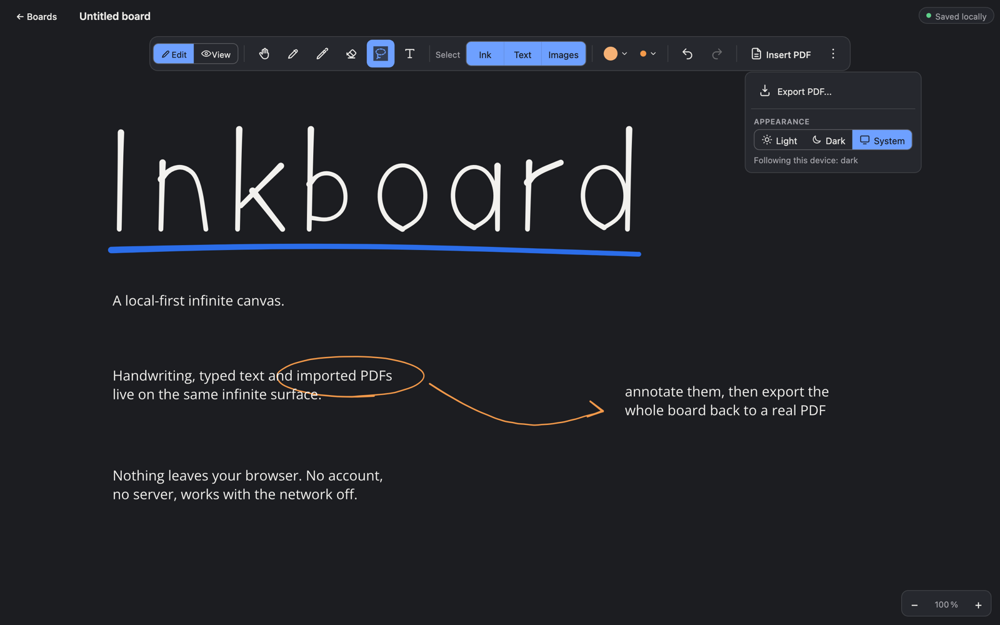
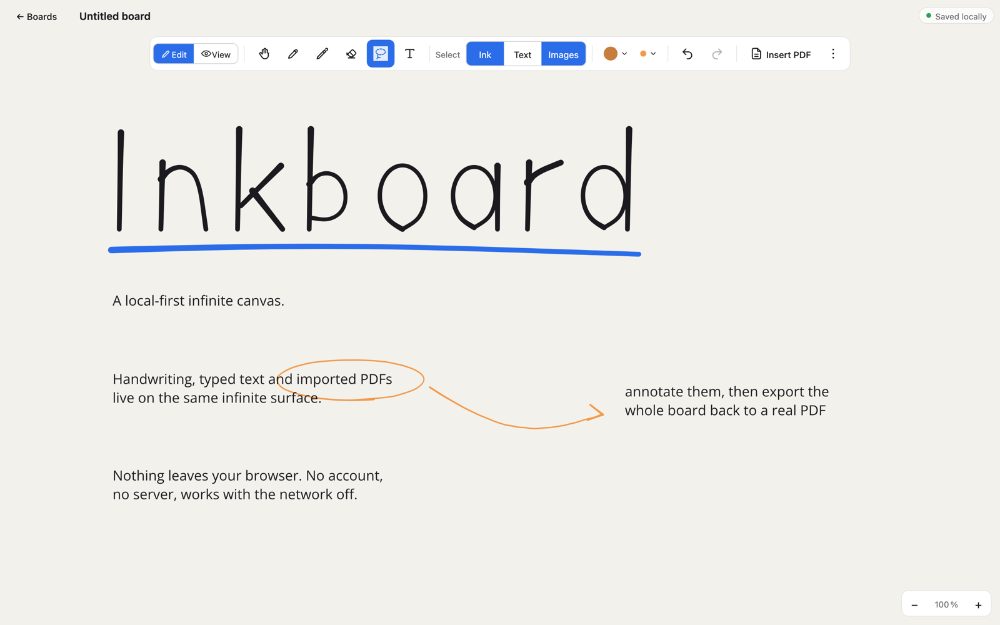

# Inkboard

A local-first infinite canvas for handwriting, typed notes and PDF annotation.
Everything lives in your browser's IndexedDB. No account, no server, works offline — including fonts and PDF export.



## Run

```bash
npm install
npm run dev        # http://localhost:5173
npm test           # vitest unit tests
npm run build      # typecheck + production bundle in dist/
```

## Features

### Canvas

- Infinite canvas with focal-point zoom (wheel, trackpad pinch, toolbar) and pan (hand tool, space+drag, middle mouse, wheel)
- Two-finger pinch and pan on touch; once a stylus has been seen, single-finger touch pans instead of drawing
- Pen and pencil, 9 preset colours plus a custom one, 5 thickness presets in world units, pressure support for stylus input
- Object eraser and CRDT-aware undo/redo
- Multiple boards, autosaved as you work; viewport and tool preferences are restored when you reopen a board

### Text

- Click anywhere with the text tool (T) and type directly on the canvas
- Multiline with automatic wrapping, a draggable width grip and content-driven height
- Four bundled open-source fonts (Open Sans, Inter, Roboto, Lato), preset sizes in world units, colour and left/centre/right alignment
- Text content is a `Y.Text`, so two replicas can type into the same box without clobbering each other

### Selection



- Lasso (L) or click to select handwriting, text and imported pages, with a forgiving 40%-inside rule; shift-lasso adds to the selection
- Make strokes thinner or thicker (`[` and `]`), recolour, move as a group, or delete
- Mixed selections only offer the controls that apply to everything in them
- Every edit is one undo step and flows through the CRDT; the selection itself stays local

### PDF

- Import via PDF.js in a worker: each page is rasterised to a JPEG asset in IndexedDB and placed as a static "printout" page
- Vertical or horizontal layout, switchable after import, with progressive rendering and a progress toast
- Move or delete pages with the hand tool, or remove a whole document
- Export back to PDF entirely in the browser: one page per imported page, A4 pagination, or a single page fitted to the content. Handwriting exports as vector paths, text as real embedded text with the font bundled in, imported pages as their stored JPEGs. No toolbars or selection outlines ever reach the file



### Themes

Light, Dark and System. Imported PDF pages and every colour you have already chosen stay exactly as they were; only the defaults for _new_ ink and text follow the theme.



## Licence

MIT — see [LICENSE.md](LICENSE.md).
